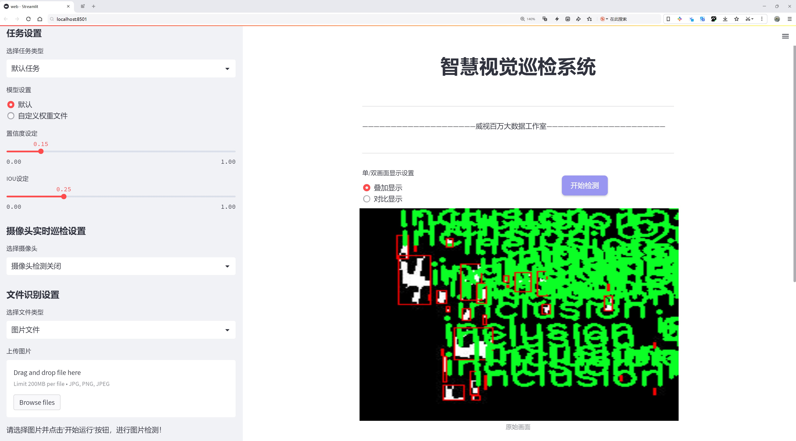
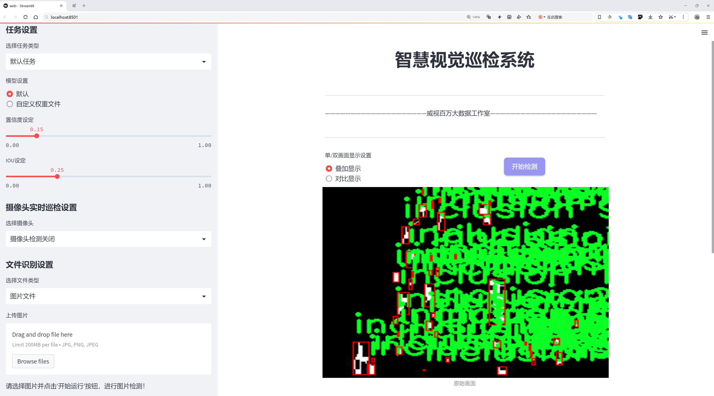
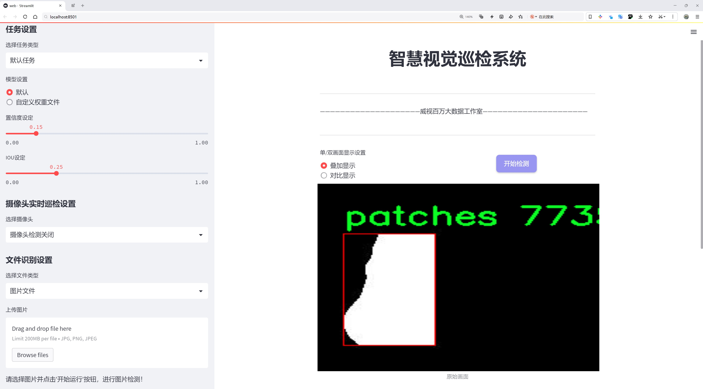
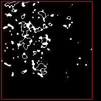
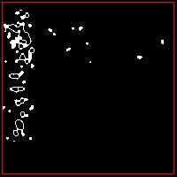
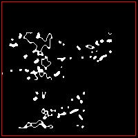
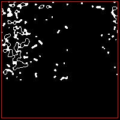
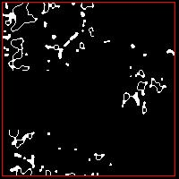

# 表面缺陷检测检测系统源码分享
 # [一条龙教学YOLOV8标注好的数据集一键训练_70+全套改进创新点发刊_Web前端展示]

### 1.研究背景与意义

项目参考[AAAI Association for the Advancement of Artificial Intelligence](https://gitee.com/qunshansj/projects)

项目来源[AACV Association for the Advancement of Computer Vision](https://gitee.com/qunmasj/projects)

研究背景与意义

随着工业生产的不断发展，表面缺陷检测在制造业中的重要性日益凸显。表面缺陷不仅影响产品的外观质量，还可能对产品的性能和使用寿命产生严重影响。因此，及时、准确地检测和识别表面缺陷，成为提高产品质量和降低生产成本的关键环节。传统的表面缺陷检测方法主要依赖人工目视检查和简单的图像处理技术，这些方法不仅效率低下，而且容易受到人为因素的影响，导致检测结果的不稳定性和不准确性。为了解决这一问题，基于深度学习的自动化检测技术逐渐成为研究的热点。

YOLO（You Only Look Once）系列模型因其高效的实时检测能力和良好的检测精度，广泛应用于目标检测领域。YOLOv8作为该系列的最新版本，进一步提升了模型的性能，特别是在小目标检测和复杂背景下的表现。通过对YOLOv8进行改进，结合特定的表面缺陷检测需求，可以有效提高检测系统的准确性和鲁棒性。本研究旨在基于改进的YOLOv8模型，构建一个高效的表面缺陷检测系统，以满足现代制造业对质量控制的严格要求。

本研究所使用的数据集包含1800张图像，涵盖了六种不同类型的表面缺陷，包括：crazing（开裂）、inclusion（夹杂物）、patches（斑点）、pitted_surface（凹坑表面）、rolled-in_scale（卷入鳞片）和scratches（划痕）。这些缺陷类型在实际生产中较为常见，且各自具有不同的特征和表现形式。通过对这些缺陷进行深入分析和建模，可以为改进YOLOv8提供丰富的训练数据，从而提升模型的学习能力和泛化能力。

在研究意义方面，首先，基于改进YOLOv8的表面缺陷检测系统能够实现对多种缺陷类型的快速、准确识别，极大地提高了检测效率，降低了人工成本。其次，该系统的应用可以有效减少因表面缺陷导致的产品返工和报废，从而提升企业的经济效益和市场竞争力。此外，随着深度学习技术的不断发展，该系统的研究和应用也为相关领域的技术进步提供了新的思路和方法，推动了智能制造和工业4.0的进程。

综上所述，基于改进YOLOv8的表面缺陷检测系统不仅具有重要的理论研究价值，也具有广泛的实际应用前景。通过深入探讨和研究该系统的构建与优化，能够为表面缺陷检测领域提供新的解决方案，推动相关技术的进步和发展。

### 2.图片演示







##### 注意：由于此博客编辑较早，上面“2.图片演示”和“3.视频演示”展示的系统图片或者视频可能为老版本，新版本在老版本的基础上升级如下：（实际效果以升级的新版本为准）

  （1）适配了YOLOV8的“目标检测”模型和“实例分割”模型，通过加载相应的权重（.pt）文件即可自适应加载模型。

  （2）支持“图片识别”、“视频识别”、“摄像头实时识别”三种识别模式。

  （3）支持“图片识别”、“视频识别”、“摄像头实时识别”三种识别结果保存导出，解决手动导出（容易卡顿出现爆内存）存在的问题，识别完自动保存结果并导出到tempDir中。

  （4）支持Web前端系统中的标题、背景图等自定义修改，后面提供修改教程。

  另外本项目提供训练的数据集和训练教程,暂不提供权重文件（best.pt）,需要您按照教程进行训练后实现图片演示和Web前端界面演示的效果。

### 3.视频演示

[3.1 视频演示](https://www.bilibili.com/video/BV1ZTtQeTEWJ/)

### 4.数据集信息展示

##### 4.1 本项目数据集详细数据（类别数＆类别名）

nc: 6
names: ['crazing', 'inclusion', 'patches', 'pitted_surface', 'rolled-in_scale', 'scratches']


##### 4.2 本项目数据集信息介绍

数据集信息展示

在本研究中，我们采用了名为“Mask_Neu_F”的数据集，以训练和改进YOLOv8模型在表面缺陷检测中的性能。该数据集专门针对工业表面缺陷的识别与分类，涵盖了六种不同类型的缺陷，分别为：crazing（表面开裂）、inclusion（夹杂物）、patches（斑点）、pitted_surface（凹坑表面）、rolled-in_scale（卷入的鳞片）和scratches（划痕）。这些缺陷在制造和加工过程中常常会影响产品的质量和外观，因此，准确识别和分类这些缺陷对于提高产品的合格率和客户满意度至关重要。

“Mask_Neu_F”数据集的构建过程经过精心设计，确保了数据的多样性和代表性。每种缺陷类型都包含了大量的样本，涵盖了不同的材质、光照条件和视角变化，以模拟实际生产环境中的各种情况。这种多样性使得模型在训练过程中能够学习到更为丰富的特征，从而提高其在真实场景中的泛化能力。数据集中的图像经过精确标注，确保每个缺陷都被清晰地框定，并附有相应的类别标签，为模型的训练提供了可靠的基础。

在数据集的使用过程中，我们采用了数据增强技术，以进一步提升模型的鲁棒性。通过对原始图像进行旋转、缩放、裁剪和颜色调整等操作，我们能够生成更多的训练样本，从而使模型在面对未见过的缺陷时，依然能够保持较高的识别准确率。这种方法不仅增加了数据集的有效样本数量，还帮助模型学习到不同缺陷在各种条件下的表现形式，增强了其对复杂环境的适应能力。

在模型训练的过程中，我们将“Mask_Neu_F”数据集划分为训练集、验证集和测试集，以便于对模型的性能进行全面评估。训练集用于模型的学习，验证集用于调优超参数，而测试集则用于最终的性能评估。通过这种划分，我们能够确保模型在训练过程中的过拟合现象得到有效控制，并能够在未见过的数据上进行真实的性能测试。

此外，为了更好地评估模型的检测效果，我们采用了多种评价指标，包括准确率、召回率和F1-score等。这些指标能够全面反映模型在不同缺陷类型上的表现，帮助我们识别模型的优缺点，并为后续的改进提供依据。通过对“Mask_Neu_F”数据集的深入分析和实验，我们期望能够显著提升YOLOv8在表面缺陷检测中的性能，推动工业自动化检测技术的发展。

总之，“Mask_Neu_F”数据集不仅为表面缺陷检测提供了丰富的样本和标注信息，也为改进YOLOv8模型的训练和评估提供了坚实的基础。通过对该数据集的充分利用，我们相信能够实现更高效、更准确的表面缺陷检测系统，为工业生产的质量控制提供强有力的支持。











### 5.全套项目环境部署视频教程（零基础手把手教学）

[5.1 环境部署教程链接（零基础手把手教学）](https://www.ixigua.com/7404473917358506534?logTag=c807d0cbc21c0ef59de5)


[5.2 安装Python虚拟环境创建和依赖库安装视频教程链接（零基础手把手教学）](https://www.ixigua.com/7404474678003106304?logTag=1f1041108cd1f708b01a)

### 6.手把手YOLOV8训练视频教程（零基础小白有手就能学会）

[6.1 手把手YOLOV8训练视频教程（零基础小白有手就能学会）](https://www.ixigua.com/7404477157818401292?logTag=d31a2dfd1983c9668658)

### 7.70+种全套YOLOV8创新点代码加载调参视频教程（一键加载写好的改进模型的配置文件）

[7.1 70+种全套YOLOV8创新点代码加载调参视频教程（一键加载写好的改进模型的配置文件）](https://www.ixigua.com/7404478314661806627?logTag=29066f8288e3f4eea3a4)

### 8.70+种全套YOLOV8创新点原理讲解（非科班也可以轻松写刊发刊，V10版本正在科研待更新）

由于篇幅限制，每个创新点的具体原理讲解就不一一展开，具体见下列网址中的创新点对应子项目的技术原理博客网址【Blog】：


[8.1 70+种全套YOLOV8创新点原理讲解链接](https://gitee.com/qunmasj/good)

### 9.系统功能展示（检测对象为举例，实际内容以本项目数据集为准）

图9.1.系统支持检测结果表格显示

  图9.2.系统支持置信度和IOU阈值手动调节

  图9.3.系统支持自定义加载权重文件best.pt(需要你通过步骤5中训练获得)

  图9.4.系统支持摄像头实时识别

  图9.5.系统支持图片识别

  图9.6.系统支持视频识别

  图9.7.系统支持识别结果文件自动保存

  图9.8.系统支持Excel导出检测结果数据


### 10.原始YOLOV8算法原理

原始YOLOv8算法原理

YOLOv8算法是由Glenn-Jocher于2023年1月提出的一种先进的目标检测模型，承袭了YOLO系列算法的优良传统，尤其是YOLOv3和YOLOv5的设计理念，同时在此基础上进行了多项重要的改进和创新。YOLOv8的推出标志着目标检测技术的又一次飞跃，其在精度和速度上的优越表现使其成为计算机视觉领域中的一颗璀璨明珠。

在数据预处理方面，YOLOv8延续了YOLOv5的成功策略，采用了多种数据增强技术，以提高模型的鲁棒性和泛化能力。这些增强手段包括马赛克增强、混合增强、空间扰动和颜色扰动等。马赛克增强通过将多张图像拼接在一起，增加了训练样本的多样性；混合增强则通过将不同图像进行混合，进一步丰富了数据集；空间扰动和颜色扰动则通过随机变换图像的空间结构和颜色特征，增强了模型对不同环境和条件的适应能力。这些数据预处理技术的结合，使得YOLOv8在训练过程中能够更好地捕捉到目标的特征，提高了模型的检测精度。

在骨干网络结构方面，YOLOv8借鉴了YOLOv5的设计理念，但进行了重要的调整。YOLOv5的主干网络采用了C3模块，通过逐层降采样和特征强化来提取特征。而在YOLOv8中，C3模块被更新为C2f模块，这一新模块引入了更多的分支，丰富了梯度回传时的支流，从而提高了特征提取的效率和效果。C2f模块的设计使得网络在处理特征时能够更加灵活和高效，进而提升了整体的检测性能。

YOLOv8依然采用了特征金字塔网络（FPN）和路径聚合网络（PAN）的结构，以实现多尺度信息的充分融合。FPN和PAN的结合使得YOLOv8能够在不同尺度上有效地捕捉目标特征，进而提升对小目标的检测能力。尽管YOLOv8在FPN-PAN结构中替换了C3模块为C2f模块，但整体结构与YOLOv5保持一致，确保了特征信息的有效传递和融合。

在检测头的设计上，YOLOv8采用了“解耦头”的结构，这一设计是YOLO系列的一次重要变革。与YOLOv3和YOLOv5的耦合头不同，解耦头将分类和定位任务分开处理，通过两条并行的分支分别提取类别特征和位置特征。这样的设计不仅提高了模型的灵活性，还增强了对复杂场景的适应能力。解耦头的引入使得YOLOv8在分类和定位的任务上能够独立优化，从而实现更高的检测精度。

在标签分配策略方面，YOLOv8引入了动态标签分配策略，解决了正负样本匹配的多尺度分配问题。与YOLOX使用的SimOTA不同，YOLOv8采用了与YOLOv6相同的TOOD策略，简化了标签分配的过程。YOLOv8的损失函数主要由类别损失和位置损失组成，其中类别损失采用了变焦损失（VFL Loss），而回归损失则结合了CIoULoss和DFLLoss。VFL Loss通过不对称参数对正负样本进行加权，使得模型在训练时能够更加关注高质量的正样本，从而提高了检测的准确性。

YOLOv8的设计不仅在理论上进行了深入的探讨，更在实践中展现出了卓越的性能。通过结合YOLOv5、YOLOv6、YOLOX等模型的优点，YOLOv8在实时目标检测领域达到了新的高度。其高精度和快速的检测速度，使得YOLOv8在各类应用场景中都展现出了强大的生命力，尤其是在自动化和智能化的应用中，如自动驾驶、智能监控等领域。

总的来说，YOLOv8算法通过对数据预处理、骨干网络、特征融合、检测头和标签分配策略等多个方面的改进，形成了一种更加高效、准确的目标检测模型。其创新的设计理念和卓越的性能，使得YOLOv8不仅是YOLO系列的最新代表，更是计算机视觉领域中的一项重要突破。随着YOLOv8的广泛应用，目标检测技术将迎来新的发展机遇，为各行各业的智能化进程提供强有力的支持。


### 11.项目核心源码讲解（再也不用担心看不懂代码逻辑）

#### 11.1 70+种YOLOv8算法改进源码大全和调试加载训练教程（非必要）\ultralytics\data\loaders.py

以下是对代码中最核心部分的提取和详细中文注释：

```python
import cv2
import numpy as np
import torch
from threading import Thread
from urllib.parse import urlparse

class LoadStreams:
    """
    用于加载各种类型视频流的类。

    支持 RTSP、RTMP、HTTP 和 TCP 流的实时捕获。

    属性:
        sources (str): 视频流的输入路径或 URL。
        imgsz (int): 处理图像的大小，默认为 640。
        vid_stride (int): 视频帧率步幅，默认为 1。
        running (bool): 表示流线程是否正在运行的标志。
        imgs (list): 每个流的图像帧列表。
        fps (list): 每个流的帧率列表。
        frames (list): 每个流的总帧数列表。
        threads (list): 每个流的线程列表。
        caps (list): 每个流的 cv2.VideoCapture 对象列表。
    """

    def __init__(self, sources='file.streams', imgsz=640, vid_stride=1):
        """初始化实例变量并检查输入流形状的一致性。"""
        self.running = True  # 线程运行标志
        self.imgsz = imgsz
        self.vid_stride = vid_stride  # 视频帧率步幅
        sources = [sources]  # 将输入源转换为列表
        self.sources = sources  # 存储源路径
        self.imgs, self.fps, self.frames, self.threads, self.caps = [[]], [0], [0], [None], [None]  # 初始化属性

        for i, s in enumerate(sources):  # 遍历每个源
            self.caps[i] = cv2.VideoCapture(s)  # 创建视频捕获对象
            if not self.caps[i].isOpened():
                raise ConnectionError(f'无法打开 {s}')  # 如果无法打开，抛出异常

            # 获取视频的宽度、高度和帧率
            w = int(self.caps[i].get(cv2.CAP_PROP_FRAME_WIDTH))
            h = int(self.caps[i].get(cv2.CAP_PROP_FRAME_HEIGHT))
            fps = self.caps[i].get(cv2.CAP_PROP_FPS)
            self.frames[i] = max(int(self.caps[i].get(cv2.CAP_PROP_FRAME_COUNT)), 0) or float('inf')  # 总帧数
            self.fps[i] = max((fps if fps > 0 else 30), 30)  # 帧率，默认为 30

            success, im = self.caps[i].read()  # 读取第一帧
            if not success or im is None:
                raise ConnectionError(f'无法从 {s} 读取图像')  # 如果读取失败，抛出异常

            self.imgs[i].append(im)  # 将第一帧添加到图像列表
            self.threads[i] = Thread(target=self.update, args=([i, self.caps[i], s]), daemon=True)  # 启动线程读取帧
            self.threads[i].start()  # 启动线程

    def update(self, i, cap, stream):
        """在守护线程中读取流 `i` 的帧。"""
        while self.running and cap.isOpened():
            cap.grab()  # 抓取帧
            if len(self.imgs[i]) < 30:  # 保持缓冲区不超过 30 帧
                success, im = cap.retrieve()  # 获取帧
                if not success:
                    im = np.zeros((self.imgsz, self.imgsz, 3), dtype=np.uint8)  # 如果失败，创建空图像
                self.imgs[i].append(im)  # 将图像添加到列表

    def close(self):
        """关闭流加载器并释放资源。"""
        self.running = False  # 停止线程
        for thread in self.threads:
            if thread.is_alive():
                thread.join(timeout=5)  # 等待线程结束
        for cap in self.caps:
            cap.release()  # 释放视频捕获对象

    def __iter__(self):
        """返回迭代器对象。"""
        self.count = -1
        return self

    def __next__(self):
        """返回源路径、转换后的图像和原始图像以供处理。"""
        self.count += 1
        images = []
        for i, x in enumerate(self.imgs):
            while not x:  # 等待帧可用
                time.sleep(1 / min(self.fps))  # 等待直到帧可用
                x = self.imgs[i]

            images.append(x.pop(0))  # 获取并移除第一帧

        return self.sources, images, None, ''  # 返回源路径和图像

    def __len__(self):
        """返回源对象的长度。"""
        return len(self.sources)  # 返回源的数量
```

### 代码核心部分分析
1. **LoadStreams 类**：这个类负责加载和处理视频流。它支持多种视频源，包括 RTSP、RTMP、HTTP 和本地摄像头。
2. **初始化方法**：在初始化时，类会尝试打开视频源并读取第一帧，以确保视频流可用。
3. **更新方法**：这是一个后台线程方法，负责不断抓取视频流中的帧并将其存储在缓冲区中。
4. **关闭方法**：负责停止线程并释放视频捕获对象，确保资源得到正确释放。
5. **迭代器方法**：实现了迭代器协议，使得该类可以被用于循环遍历，返回每一帧图像。

### 总结
这个代码片段是 YOLOv8 模型的一部分，专注于视频流的加载和处理，确保能够实时获取视频帧以供后续的目标检测等任务。

这个文件是YOLOv8算法的一个重要组成部分，主要负责加载不同类型的数据源，包括视频流、截图、图像文件等，以便进行目标检测。文件中定义了多个类，每个类负责处理不同的数据加载方式。

首先，`SourceTypes`类用于表示输入源的类型，包括网络摄像头、截图、图像文件和张量等。接下来是`LoadStreams`类，它负责从各种视频流中加载数据，支持RTSP、RTMP、HTTP和TCP流。该类的构造函数初始化了一些参数，如图像大小、视频帧率步幅等，并通过多线程读取视频流的帧。它还提供了`update`方法来持续读取视频帧，并在需要时重启流。`close`方法用于关闭流并释放资源。

`LoadScreenshots`类则专注于从屏幕捕获截图，支持指定捕获区域的参数。它使用`mss`库来实现屏幕捕获，并提供了迭代器方法来逐帧返回捕获的图像。

`LoadImages`类用于加载图像和视频文件，支持从单个文件、视频文件或图像路径列表中读取数据。它会根据文件的扩展名判断文件类型，并在读取视频时使用OpenCV的`VideoCapture`对象。

`LoadPilAndNumpy`类用于从PIL图像和Numpy数组中加载图像数据，确保输入图像格式正确并进行必要的转换。它支持批处理图像。

`LoadTensor`类则专注于从PyTorch张量中加载图像数据，确保输入张量的形状和数据范围符合要求。

此外，文件中还定义了`autocast_list`函数，用于将不同类型的输入源合并为Numpy数组或PIL图像列表。`get_best_youtube_url`函数则用于从YouTube视频中提取最佳质量的MP4视频流URL。

最后，`LOADERS`元组将所有加载器类组合在一起，方便后续调用。整个文件的设计旨在为YOLOv8提供灵活且高效的数据加载能力，以支持各种输入源的目标检测任务。

#### 11.2 ui.py

```python
import sys
import subprocess

def run_script(script_path):
    """
    使用当前 Python 环境运行指定的脚本。

    Args:
        script_path (str): 要运行的脚本路径

    Returns:
        None
    """
    # 获取当前 Python 解释器的路径
    python_path = sys.executable

    # 构建运行命令，使用 streamlit 运行指定的脚本
    command = f'"{python_path}" -m streamlit run "{script_path}"'

    # 执行命令并等待其完成
    result = subprocess.run(command, shell=True)
    
    # 检查命令执行结果，如果返回码不为0，则表示出错
    if result.returncode != 0:
        print("脚本运行出错。")


# 实例化并运行应用
if __name__ == "__main__":
    # 指定要运行的脚本路径
    script_path = "web.py"  # 这里可以直接指定脚本名

    # 调用函数运行脚本
    run_script(script_path)
```

### 代码注释说明：

1. **导入模块**：
   - `sys`：用于访问与 Python 解释器相关的变量和函数。
   - `subprocess`：用于创建新进程、连接到它们的输入/输出/错误管道，并获得返回码。

2. **`run_script` 函数**：
   - 该函数接收一个脚本路径作为参数，并使用当前 Python 环境运行该脚本。
   - `python_path = sys.executable`：获取当前 Python 解释器的路径，以确保使用正确的 Python 环境。
   - `command`：构建要执行的命令字符串，使用 `streamlit` 模块运行指定的脚本。
   - `subprocess.run(command, shell=True)`：执行构建的命令，并等待其完成。
   - `if result.returncode != 0`：检查命令的返回码，如果不为0，表示脚本运行出错，打印错误信息。

3. **主程序部分**：
   - `if __name__ == "__main__":`：确保该部分代码仅在直接运行脚本时执行，而不是在被导入时执行。
   - `script_path = "web.py"`：指定要运行的脚本文件名。
   - `run_script(script_path)`：调用 `run_script` 函数，传入脚本路径以执行。

这个程序文件名为 `ui.py`，其主要功能是使用当前的 Python 环境来运行一个指定的脚本，具体是一个名为 `web.py` 的 Streamlit 应用。

首先，程序导入了必要的模块，包括 `sys`、`os` 和 `subprocess`。`sys` 模块用于访问与 Python 解释器相关的变量和函数，`os` 模块提供了与操作系统交互的功能，而 `subprocess` 模块则用于创建新进程、连接到它们的输入/输出/错误管道，并获取它们的返回码。

接下来，程序从 `QtFusion.path` 模块中导入了 `abs_path` 函数，这个函数的作用是获取给定路径的绝对路径。

在 `run_script` 函数中，程序接收一个参数 `script_path`，这个参数是要运行的脚本的路径。函数首先获取当前 Python 解释器的路径，并将其存储在 `python_path` 变量中。然后，构建一个命令字符串，使用 `streamlit run` 命令来运行指定的脚本。这个命令将被传递给 `subprocess.run` 函数，以在一个新的 shell 中执行。

执行命令后，程序检查返回码。如果返回码不为零，表示脚本运行过程中出现了错误，程序会打印出“脚本运行出错。”的提示信息。

在文件的最后部分，使用 `if __name__ == "__main__":` 语句来确保只有在直接运行该脚本时才会执行后面的代码。程序指定了要运行的脚本路径，这里使用 `abs_path` 函数获取 `web.py` 的绝对路径。最后，调用 `run_script` 函数来执行这个脚本。

总体来说，这个程序的功能是简洁明了的，它提供了一种方便的方式来启动一个 Streamlit 应用，确保使用的是当前 Python 环境，并处理可能出现的错误。

#### 11.3 70+种YOLOv8算法改进源码大全和调试加载训练教程（非必要）\ultralytics\nn\__init__.py

```python
# 导入所需的模型和工具函数
from .tasks import (BaseModel, ClassificationModel, DetectionModel, SegmentationModel, 
                    attempt_load_one_weight, attempt_load_weights, guess_model_scale, 
                    guess_model_task, parse_model, torch_safe_load, yaml_model_load)

# 定义模块的公开接口，指定可以被外部访问的函数和类
__all__ = ('attempt_load_one_weight', 'attempt_load_weights', 'parse_model', 'yaml_model_load', 
           'guess_model_task', 'guess_model_scale', 'torch_safe_load', 
           'DetectionModel', 'SegmentationModel', 'ClassificationModel', 'BaseModel')
```

### 代码核心部分及注释

1. **导入模块**：
   - `from .tasks import ...`：从当前包的 `tasks` 模块中导入多个类和函数。这些类和函数是实现模型加载、解析和推理的核心功能。

2. **定义公开接口**：
   - `__all__`：这是一个特殊变量，用于定义模块的公共接口。它列出了在使用 `from module import *` 时可以导入的名称。这样做可以控制哪些部分是模块的公共 API，避免外部访问不必要的内部实现。

### 主要功能
- **模型类**：
  - `BaseModel`：基础模型类，可能包含所有模型的共通功能。
  - `ClassificationModel`：分类模型类，用于图像分类任务。
  - `DetectionModel`：检测模型类，用于目标检测任务。
  - `SegmentationModel`：分割模型类，用于图像分割任务。

- **工具函数**：
  - `attempt_load_one_weight`：尝试加载单个权重文件。
  - `attempt_load_weights`：尝试加载多个权重文件。
  - `guess_model_scale`：根据输入信息推测模型的规模。
  - `guess_model_task`：根据输入信息推测模型的任务类型。
  - `parse_model`：解析模型结构。
  - `torch_safe_load`：安全加载 PyTorch 模型。
  - `yaml_model_load`：从 YAML 文件加载模型配置。

这个程序文件是YOLO（You Only Look Once）系列算法的一部分，具体是Ultralytics YOLO的一个模块，文件名为`__init__.py`，它主要用于初始化包的内容。文件中首先包含了一条版权声明，表明该代码遵循AGPL-3.0许可证。

接下来，文件通过相对导入的方式引入了多个模型和函数。这些模型包括基础模型（BaseModel）、分类模型（ClassificationModel）、检测模型（DetectionModel）和分割模型（SegmentationModel）。此外，还引入了一些辅助函数，例如`attempt_load_one_weight`和`attempt_load_weights`，这些函数可能用于加载模型权重；`guess_model_scale`和`guess_model_task`用于推测模型的规模和任务类型；`parse_model`用于解析模型结构；`torch_safe_load`和`yaml_model_load`则可能与安全加载PyTorch模型和加载YAML格式的模型配置相关。

最后，`__all__`变量定义了该模块公开的接口，列出了可以被外部访问的函数和类。这种做法有助于控制模块的命名空间，确保用户只接触到必要的部分，从而提高代码的可维护性和可读性。总的来说，这个文件是YOLOv8算法实现的一个重要组成部分，提供了模型和功能的组织结构。

#### 11.4 code\ultralytics\models\yolo\pose\__init__.py

以下是代码中最核心的部分，并附上详细的中文注释：

```python
# 导入必要的模块
from .predict import PosePredictor  # 导入姿态预测器
from .train import PoseTrainer      # 导入姿态训练器
from .val import PoseValidator      # 导入姿态验证器

# 定义模块的公开接口
__all__ = "PoseTrainer", "PoseValidator", "PosePredictor"  # 指定在使用 'from module import *' 时，哪些类或函数是可用的
```

### 注释说明：
1. **模块导入**：
   - `from .predict import PosePredictor`：从当前包中导入 `PosePredictor` 类，负责进行姿态预测。
   - `from .train import PoseTrainer`：从当前包中导入 `PoseTrainer` 类，负责训练姿态模型。
   - `from .val import PoseValidator`：从当前包中导入 `PoseValidator` 类，负责验证姿态模型的性能。

2. **公开接口定义**：
   - `__all__` 是一个特殊变量，用于定义当使用 `from module import *` 时，哪些名称是可以被导入的。在这里，指定了 `PoseTrainer`、`PoseValidator` 和 `PosePredictor` 三个类为模块的公开接口，表示这些类是模块的主要功能部分。

这个程序文件是一个Python模块的初始化文件，文件名为`__init__.py`，它位于`code/ultralytics/models/yolo/pose/`目录下。该文件的主要功能是定义模块的公共接口，并导入相关的类或函数，以便在其他地方使用。

首先，文件顶部的注释`# Ultralytics YOLO 🚀, AGPL-3.0 license`表明该模块属于Ultralytics YOLO项目，并且使用AGPL-3.0许可证。这是一个开源许可证，允许用户自由使用、修改和分发代码，但要求在分发时也必须开放源代码。

接下来，文件通过`from .predict import PosePredictor`、`from .train import PoseTrainer`和`from .val import PoseValidator`这三行代码导入了三个类：`PosePredictor`、`PoseTrainer`和`PoseValidator`。这些类分别用于姿态预测、训练和验证。通过这种方式，模块可以将这些功能集中在一起，方便用户进行姿态估计相关的操作。

最后，`__all__`变量被定义为一个元组，包含了字符串`"PoseTrainer"`、`"PoseValidator"`和`"PosePredictor"`。这个变量的作用是指定当使用`from module import *`语句时，哪些名称会被导入。这样可以控制模块的公共接口，避免不必要的内部实现细节被暴露给用户。

总的来说，这个`__init__.py`文件的作用是组织和导出与姿态估计相关的功能，使得用户在使用这个模块时能够方便地访问所需的类和功能。

#### 11.5 70+种YOLOv8算法改进源码大全和调试加载训练教程（非必要）\ultralytics\models\yolo\pose\predict.py

以下是代码中最核心的部分，并附上详细的中文注释：

```python
from ultralytics.engine.results import Results  # 导入结果处理类
from ultralytics.models.yolo.detect.predict import DetectionPredictor  # 导入检测预测器基类
from ultralytics.utils import DEFAULT_CFG, LOGGER, ops  # 导入默认配置、日志记录器和操作工具

class PosePredictor(DetectionPredictor):
    """
    PosePredictor类，扩展了DetectionPredictor类，用于基于姿态模型的预测。
    """

    def __init__(self, cfg=DEFAULT_CFG, overrides=None, _callbacks=None):
        """初始化PosePredictor，设置任务为'pose'并记录使用'mps'作为设备的警告。"""
        super().__init__(cfg, overrides, _callbacks)  # 调用父类构造函数
        self.args.task = 'pose'  # 设置任务类型为姿态检测
        # 检查设备类型，如果是'mps'，则发出警告
        if isinstance(self.args.device, str) and self.args.device.lower() == 'mps':
            LOGGER.warning("WARNING ⚠️ Apple MPS known Pose bug. Recommend 'device=cpu' for Pose models. "
                           'See https://github.com/ultralytics/ultralytics/issues/4031.')

    def postprocess(self, preds, img, orig_imgs):
        """对给定输入图像或图像列表返回检测结果。"""
        # 应用非极大值抑制（NMS）以过滤重叠的检测框
        preds = ops.non_max_suppression(preds,
                                        self.args.conf,  # 置信度阈值
                                        self.args.iou,  # IOU阈值
                                        agnostic=self.args.agnostic_nms,  # 是否类别无关的NMS
                                        max_det=self.args.max_det,  # 最大检测框数量
                                        classes=self.args.classes,  # 选择的类别
                                        nc=len(self.model.names))  # 类别数量

        # 如果输入图像不是列表，则将其转换为numpy数组
        if not isinstance(orig_imgs, list):
            orig_imgs = ops.convert_torch2numpy_batch(orig_imgs)

        results = []  # 存储结果的列表
        for i, pred in enumerate(preds):  # 遍历每个预测结果
            orig_img = orig_imgs[i]  # 获取原始图像
            # 将预测框的坐标缩放到原始图像的尺寸
            pred[:, :4] = ops.scale_boxes(img.shape[2:], pred[:, :4], orig_img.shape).round()
            # 获取关键点预测，并进行坐标缩放
            pred_kpts = pred[:, 6:].view(len(pred), *self.model.kpt_shape) if len(pred) else pred[:, 6:]
            pred_kpts = ops.scale_coords(img.shape[2:], pred_kpts, orig_img.shape)
            img_path = self.batch[0][i]  # 获取图像路径
            # 将结果添加到结果列表中
            results.append(
                Results(orig_img, path=img_path, names=self.model.names, boxes=pred[:, :6], keypoints=pred_kpts))
        return results  # 返回所有结果
```

### 代码说明：
1. **PosePredictor类**：这是一个用于姿态检测的预测器类，继承自`DetectionPredictor`。
2. **初始化方法**：在初始化时，设置任务类型为姿态检测，并检查设备类型以发出警告。
3. **后处理方法**：该方法负责对模型的预测结果进行后处理，包括应用非极大值抑制、缩放检测框和关键点坐标，并将结果存储在`Results`对象中。最终返回处理后的结果列表。

该程序文件是Ultralytics YOLO（You Only Look Once）系列模型中的一个用于姿态预测的类，名为`PosePredictor`。它继承自`DetectionPredictor`类，专门用于处理基于姿态模型的预测任务。

在文件的开头，导入了一些必要的模块和类，包括`Results`、`DetectionPredictor`和一些工具函数。`Results`类用于存储和处理预测结果，而`DetectionPredictor`是一个通用的检测预测器，提供了基础的检测功能。

`PosePredictor`类的构造函数`__init__`接受三个参数：`cfg`（配置），`overrides`（覆盖配置），和`_callbacks`（回调函数）。在初始化过程中，调用了父类的构造函数，并将任务类型设置为'pose'，表示该预测器将用于姿态估计。此外，如果设备类型被设置为'MPS'（Apple的Metal Performance Shaders），则会发出警告，建议使用'cpu'设备，因为在使用MPS时已知存在一些姿态模型的bug。

`postprocess`方法用于处理模型的预测结果。它接收三个参数：`preds`（预测结果），`img`（输入图像），和`orig_imgs`（原始图像）。首先，该方法调用`non_max_suppression`函数对预测结果进行非极大值抑制，以去除冗余的检测框。接着，如果输入的原始图像不是列表格式，则将其转换为NumPy数组。

接下来，方法会遍历每个预测结果，并对每个预测框进行坐标缩放，以适应原始图像的尺寸。然后提取关键点信息，并同样进行坐标缩放。最后，将处理后的结果封装到`Results`对象中，包括原始图像、图像路径、模型名称、检测框和关键点信息，并将这些结果存储在一个列表中返回。

总体而言，该文件的主要功能是实现基于YOLOv8模型的姿态预测，并对预测结果进行后处理，以便于进一步分析和使用。

#### 11.6 train.py

以下是代码中最核心的部分，并附上详细的中文注释：

```python
class DetectionTrainer(BaseTrainer):
    """
    DetectionTrainer类，继承自BaseTrainer类，用于基于检测模型的训练。
    """

    def build_dataset(self, img_path, mode="train", batch=None):
        """
        构建YOLO数据集。

        参数:
            img_path (str): 包含图像的文件夹路径。
            mode (str): 模式，可以是'train'或'val'，用户可以为每种模式自定义不同的增强。
            batch (int, optional): 批次大小，仅适用于'rect'模式。默认为None。
        """
        gs = max(int(de_parallel(self.model).stride.max() if self.model else 0), 32)
        return build_yolo_dataset(self.args, img_path, batch, self.data, mode=mode, rect=mode == "val", stride=gs)

    def get_dataloader(self, dataset_path, batch_size=16, rank=0, mode="train"):
        """构造并返回数据加载器。"""
        assert mode in ["train", "val"]  # 确保模式是'train'或'val'
        with torch_distributed_zero_first(rank):  # 仅在DDP情况下初始化数据集*.cache一次
            dataset = self.build_dataset(dataset_path, mode, batch_size)  # 构建数据集
        shuffle = mode == "train"  # 训练模式下打乱数据
        if getattr(dataset, "rect", False) and shuffle:
            LOGGER.warning("WARNING ⚠️ 'rect=True'与DataLoader的shuffle不兼容，设置shuffle=False")
            shuffle = False
        workers = self.args.workers if mode == "train" else self.args.workers * 2  # 设置工作线程数
        return build_dataloader(dataset, batch_size, workers, shuffle, rank)  # 返回数据加载器

    def preprocess_batch(self, batch):
        """对一批图像进行预处理，包括缩放和转换为浮点数。"""
        batch["img"] = batch["img"].to(self.device, non_blocking=True).float() / 255  # 将图像转移到设备并归一化
        if self.args.multi_scale:  # 如果启用多尺度
            imgs = batch["img"]
            sz = (
                random.randrange(self.args.imgsz * 0.5, self.args.imgsz * 1.5 + self.stride)
                // self.stride
                * self.stride
            )  # 随机选择尺寸
            sf = sz / max(imgs.shape[2:])  # 计算缩放因子
            if sf != 1:  # 如果缩放因子不为1
                ns = [
                    math.ceil(x * sf / self.stride) * self.stride for x in imgs.shape[2:]
                ]  # 计算新的形状
                imgs = nn.functional.interpolate(imgs, size=ns, mode="bilinear", align_corners=False)  # 进行插值
            batch["img"] = imgs  # 更新图像
        return batch

    def get_model(self, cfg=None, weights=None, verbose=True):
        """返回YOLO检测模型。"""
        model = DetectionModel(cfg, nc=self.data["nc"], verbose=verbose and RANK == -1)  # 创建检测模型
        if weights:
            model.load(weights)  # 加载权重
        return model

    def get_validator(self):
        """返回用于YOLO模型验证的DetectionValidator。"""
        self.loss_names = "box_loss", "cls_loss", "dfl_loss"  # 定义损失名称
        return yolo.detect.DetectionValidator(
            self.test_loader, save_dir=self.save_dir, args=copy(self.args), _callbacks=self.callbacks
        )  # 返回验证器

    def plot_training_samples(self, batch, ni):
        """绘制带有注释的训练样本。"""
        plot_images(
            images=batch["img"],
            batch_idx=batch["batch_idx"],
            cls=batch["cls"].squeeze(-1),
            bboxes=batch["bboxes"],
            paths=batch["im_file"],
            fname=self.save_dir / f"train_batch{ni}.jpg",
            on_plot=self.on_plot,
        )  # 绘制图像

    def plot_metrics(self):
        """从CSV文件中绘制指标。"""
        plot_results(file=self.csv, on_plot=self.on_plot)  # 保存结果图
```

### 代码核心部分解释：
1. **DetectionTrainer类**：这是一个用于训练YOLO检测模型的类，继承自BaseTrainer类。
2. **build_dataset方法**：构建YOLO数据集，处理图像路径和增强模式。
3. **get_dataloader方法**：构造数据加载器，设置批次大小和工作线程数。
4. **preprocess_batch方法**：对图像批次进行预处理，包括归一化和多尺度调整。
5. **get_model方法**：返回YOLO检测模型，并可选择加载预训练权重。
6. **get_validator方法**：返回用于模型验证的检测验证器。
7. **plot_training_samples和plot_metrics方法**：用于可视化训练样本和训练指标。

这个程序文件 `train.py` 是一个用于训练 YOLO（You Only Look Once）目标检测模型的实现，继承自 `BaseTrainer` 类。程序的主要功能是构建数据集、加载数据、预处理图像、设置模型属性、获取模型、进行验证、记录损失、绘制训练样本和绘制训练指标等。

首先，程序导入了一些必要的库和模块，包括数学运算、随机数生成、深度学习相关的 PyTorch 模块，以及 YOLO 相关的功能模块。接着，定义了 `DetectionTrainer` 类，这个类主要负责训练过程中的各项任务。

在 `build_dataset` 方法中，程序根据给定的图像路径和模式（训练或验证）构建 YOLO 数据集。该方法还允许用户为不同模式自定义数据增强策略。`get_dataloader` 方法则用于构建数据加载器，确保在分布式训练时只初始化一次数据集，并根据模式设置是否打乱数据顺序。

`preprocess_batch` 方法负责对输入的图像批次进行预处理，包括将图像缩放到适当的大小并转换为浮点数格式。该方法还支持多尺度训练，通过随机选择图像大小来增强模型的鲁棒性。

`set_model_attributes` 方法用于设置模型的属性，包括类别数量和类别名称等，以确保模型能够正确处理输入数据。`get_model` 方法则用于返回一个 YOLO 检测模型，并可以加载预训练权重。

在验证过程中，`get_validator` 方法返回一个用于模型验证的 `DetectionValidator` 实例，记录损失项的名称以便后续分析。`label_loss_items` 方法用于生成一个包含训练损失项的字典，方便监控训练过程中的损失变化。

`progress_string` 方法返回一个格式化的字符串，显示训练进度，包括当前的轮次、GPU 内存使用情况、损失值、实例数量和图像大小等信息。`plot_training_samples` 方法用于绘制训练样本及其标注，便于可视化训练数据的质量。

最后，`plot_metrics` 和 `plot_training_labels` 方法分别用于绘制训练过程中的指标和标签，帮助用户分析模型的训练效果和性能。

整体而言，这个程序文件为 YOLO 模型的训练提供了一个完整的框架，涵盖了数据处理、模型构建、训练监控和结果可视化等多个方面。

### 12.系统整体结构（节选）

### 整体功能和构架概括

该项目是一个基于YOLOv8的目标检测框架，提供了丰富的功能以支持模型的训练、验证和推理。整体架构分为多个模块，每个模块负责特定的功能，确保代码的可维护性和可扩展性。主要模块包括数据加载、模型定义、训练过程、验证过程和用户界面等。

- **数据加载**：通过`loaders.py`文件，支持从多种数据源（如图像、视频、屏幕截图等）加载数据，并进行必要的预处理。
- **模型定义**：通过`__init__.py`和相关文件，定义了不同类型的YOLO模型（如检测、分类、姿态估计等），并提供了模型的构建和权重加载功能。
- **训练过程**：`train.py`文件负责模型的训练过程，包括数据集构建、损失计算、训练监控和结果可视化。
- **验证过程**：通过不同的验证器类，支持对训练好的模型进行评估，确保模型的性能。
- **用户界面**：`ui.py`文件提供了一个简单的用户界面，方便用户启动和运行模型。

### 文件功能整理表

| 文件路径                                                                                               | 功能描述                                                                                         |
|--------------------------------------------------------------------------------------------------------|--------------------------------------------------------------------------------------------------|
| `ultralytics\data\loaders.py`                                                                          | 提供数据加载功能，支持从多种数据源加载数据（图像、视频、屏幕截图等），并进行预处理。           |
| `ui.py`                                                                                                 | 提供用户界面，允许用户启动和运行指定的Streamlit应用。                                          |
| `ultralytics\nn\__init__.py`                                                                           | 初始化YOLO模型模块，导入模型和相关功能，定义公共接口。                                         |
| `ultralytics\models\yolo\pose\__init__.py`                                                            | 初始化姿态估计模块，导入姿态预测、训练和验证相关的类。                                         |
| `ultralytics\models\yolo\pose\predict.py`                                                             | 实现姿态预测功能，处理模型的预测结果并进行后处理。                                             |
| `train.py`                                                                                              | 负责模型的训练过程，包括数据集构建、模型属性设置、损失计算和训练监控等。                      |
| `ultralytics\cfg\__init__.py`                                                                          | 初始化配置模块，可能包含模型配置和超参数设置。                                                |
| `ultralytics\utils\callbacks\raytune.py`                                                              | 提供与Ray Tune集成的回调功能，用于超参数优化和训练监控。                                       |
| `ultralytics\models\yolo\classify\val.py`                                                             | 实现分类模型的验证功能，评估模型在验证集上的性能。                                            |
| `ultralytics\models\fastsam\predict.py`                                                                | 实现快速分割模型的预测功能，处理输入数据并返回分割结果。                                       |
| `ultralytics\data\build.py`                                                                             | 可能用于构建数据集或数据处理管道，支持数据预处理和增强。                                       |
| `val.py`                                                                                                 | 负责模型验证过程，评估训练好的模型性能，可能与不同模型类型相关。                              |
| `ultralytics\utils\callbacks\clearml.py`                                                               | 提供与ClearML集成的回调功能，用于实验管理和监控。                                              |

这个表格总结了项目中各个文件的主要功能，帮助理解整个YOLOv8框架的结构和各个组件之间的关系。

注意：由于此博客编辑较早，上面“11.项目核心源码讲解（再也不用担心看不懂代码逻辑）”中部分代码可能会优化升级，仅供参考学习，完整“训练源码”、“Web前端界面”和“70+种创新点源码”以“13.完整训练+Web前端界面+70+种创新点源码、数据集获取”的内容为准。

### 13.完整训练+Web前端界面+70+种创新点源码、数据集获取


# [下载链接：https://mbd.pub/o/bread/ZpuXlJtu](https://mbd.pub/o/bread/ZpuXlJtu)